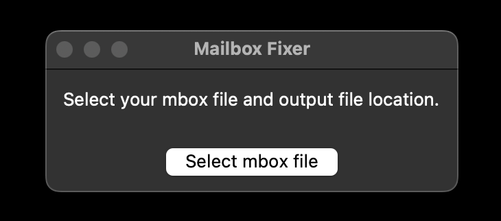
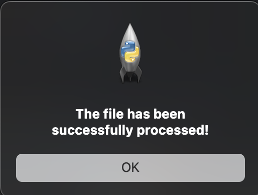

# Mail-By-Frequency

## Sort Mail by sender frequency and tackle the worst spam first.

<br>

*I'm sitting here right now paranoid because I had an incredibly important email that got buried by the daily spam. Not wanting this to ever happen again, I decided that it was time to filter out the spam and make rules for my mailbox. Unfortunately, my inbox has over 30,000 unread emails. I just created it two years ago, because the same thing happened to my other email. I'm not going to keep creating new email accounts, so I decided to take on the task, one by one, of which email addresses to move to junk.*

<br>

**This is how it was going:**

<br>

  1. Going from most recent emails, I see an email that's spam (nearly the entire screen).
  2. I copy that email address, search it, and move all emails from them to spam.
  3. 29,991 unread emails left
  4. Repeat

<br>

After about 5 minutes, I realized...**this is going to take all night**.

<br>

I thought *"this would be way easier if I could just tackle the ones that email me the most, and then I could do the less frequent ones as they come in over time"*.

<br><br>

***So I created this Python application***

<br><br>

This is a starting point to eventually creating a plugin for MacOS's default Mail app. The documentation on MailKit is incredibly weak, as MailKit is a very recent addition to Swift. It doesn't look like it's possible to use MailKit at the current moment for what I'd like to do. To make matters worse, there's another (and more popular) software that is also named MailKit. Turning this into a MacOS app would be a nice end goal though...eventually.

<br><br>

## Main Menu



<br><br>

## Alert Box



<br><br>

# How this works

## Installation

<br>

### MacOS

<br>

If you have homebrew/git installed, you can just enter into your terminal:

```
git clone https://github.com/JoshJarabek7/Mail-By-Frequency.git
```

*Otherwise:*

1. Go up top, hit the green "Code" button, and download as a zip.
2. Unzip the file, which should be in your "Downloads" folder.

<br>
<br>

## Setup

<br>

1. Using whatever mail platform you use, export your mailbox as **"mbox"** type file
2. Within the new unzipped folder, there should be another folder named "mbox"
3. Add your exported mbox file into the mbox folder
4. Once unzipped, go to your launchpad, open the "others" folder, and click "Terminal"
5. If the unzipped file is in your "Downloads" folder, type into the terminal:

        `python Downloads/Mail-By-Frequency/main.py` 

6. Hit enter and you'll be guided through the rest

<br>
<br>
<br>

# Roadmap

~~Create a GUI version to make things easier~~

- Dive deeper into whether Swift's MailKit will allow access to MacOS Mail app in a way that lets you loop through messages
- Make a web-based version


